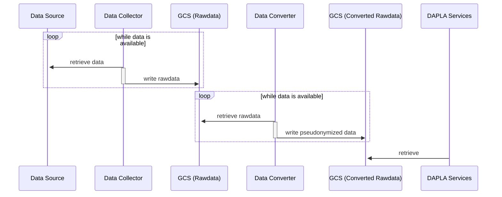

## What is Data Conversion all about?

The goals of _Data Conversion_ in DAPLA are:
* Transform rawdata - that is: data on _whichever_ data format - to a standardized and common data format (avro!)
* Enrich the dataset with required metadata in order to:
  * protect data integrity
  * facilitate for security and data ownership
  * ensure discoverability
* Perform pseudonymization

## What is "Rawdata"?

The term _Rawdata_ is used about data that is _unprocessed_. It denotes data that has simply been transmitted from a data source. The data can be described in a plethora of different data formats.

An important domain object in DAPLA is the "RawdataMessage". In essence it is an envelope that wraps
a set of data elements according to a given data entity.

The Data Collection applications are responsible for _producing_ streams of such RawdataMessages. Producing means: Fetch data from a data source and assemble RawdataMessages on an entity basis.

The Data Conversion applications are responsible for _consuming_ streams of RawdataMessages. Consuming means: Transform rawdata to a common format and make it available in the DAPLA data lake.

We typically denote the process of Data Collection and Data Conversion as _Data Ingestion_.

## High Level steps

The following sketch shows a general view of the different steps involved in the DAPLA Data Ingestion process.

