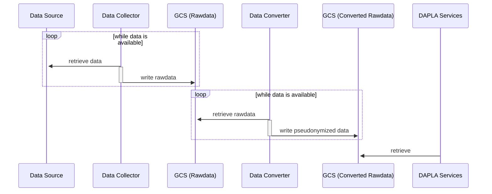

```mermaid
sequenceDiagram
    participant Source as Data Source
    participant Collector as Data Collector
    participant RawdataGCS as GCS (Rawdata)
    participant Converter as Data Converter
    participant ConvertedGCS as GCS (Converted Rawdata)
    participant DAPLA as DAPLA Services

    loop while data is available
      Collector->>+Source: retrieve data
      activate Collector
      Collector->>RawdataGCS: write rawdata
      deactivate Collector
    end

    loop while data is available
      Converter->>+RawdataGCS: retrieve rawdata
      activate Converter
      Converter->>ConvertedGCS: write pseudonymized data
      deactivate Converter
    end

    DAPLA->>+ConvertedGCS: retrieve
```

> TODO: A short snippet - using a sequence diagram? - about what "Data Conversion" is all about.

