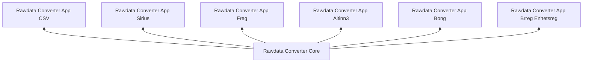

{}
Make sure you have configured your [development environment]().
{}

```mermaid
graph BT
  Core["Rawdata Converter Core"]
  Core["Rawdata Converter Core"] --> AppCsv["Rawdata Converter App CSV"]
  Core["Rawdata Converter Core"] --> AppSirius["Rawdata Converter App Sirius"]
  Core["Rawdata Converter Core"] --> AppFreg["Rawdata Converter App Freg"]
  Core["Rawdata Converter Core"] --> AppAltinn3["Rawdata Converter App Altinn3"]
  Core["Rawdata Converter Core"] --> AppBong["Rawdata Converter App Bong"]
  Core["Rawdata Converter Core"] --> AppEnhetsreg["Rawdata Converter App Brreg Enhetsreg"]
```
