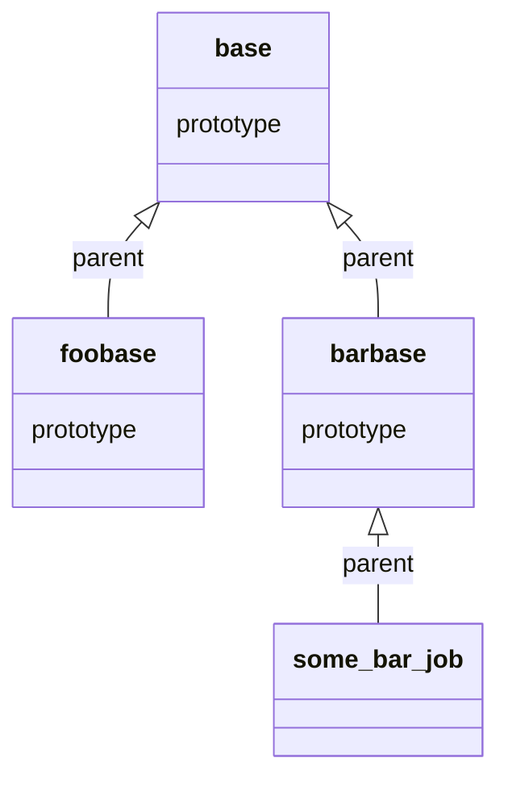

## application.yml

Rawdata converter apps read config from an `application.yml` file. The following sections must be provided:

| Prefix                             | Description  
|:---------------------------------- |:-------------
| `micronaut`                         | properties common for all [Micronaut applications](https://docs.micronaut.io/latest/guide/index.html#config)
| `services`                         | External services that the converter app talks to
| `rawdata.sources`                  | Named rawdata sources that can be referenced by a converter job. Contains config that will be fed to the underlying [rawdata-client](https://github.com/statisticsnorway/rawdata-client) used for reading a stream of rawdata.
| `rawdata.converter.job-scheduler`  | Config specific to the scheduler process that is responsible for initializing and keeping track of converter jobs
| `rawdata.converter.jobs`           | Contains config specific for the converter jobs that the converter app manages. Converter jobs come in two flavours: *"prototypes"* or concrete jobs. *Prototype* jobs are only used to hold configuration that other jobs inherit. They cannot be executed themselves. Job configs can inherit from another job configuration by using the `parent` keyword. See [Rawdata Converter Job Config]().

An example says more than a 1000 words:

```yaml
        micronaut:
          server.port: 8080

        services:
          dapla-oauth:
            host: https://keycloak.staging-bip-app.ssb.no
            token-endpoint-path: /auth/realms/ssb/protocol/openid-connect/token
            token-provider: keycloak
          dapla-data-access:
            impl: HTTP
            host: http://data-access.dapla.svc.cluster.local
            port: 80
          dapla-metadata-distributor:
            impl: HTTP
            host: http://metadata-distributor.dapla.svc.cluster.local
            port: 80
            project-id: staging-bip
            topic: metadata-distributor-dataset-updates

        rawdata.sources:
          foo:
            rawdata-client:
              provider: gcs
              local-temp-folder: temp
              avro-file:
                max.seconds: 3600
                max.bytes: 10485760
                sync.interval: 500000
              gcs:
                bucket-name: ssb-rawdata-staging-foo
                credential-provider: compute-engine
                service-account.key-file: leaving-this-blank-does-not-work
                listing.min-interval-seconds: 15

          localfoo:
            rawdata-client:
              provider: filesystem
              local-temp-folder: temp
              avro-file:
                  max.seconds: 3600
                  max.bytes: 10485760
                  sync.interval: 500000
              filesystem:
                  storage-folder: ../localenv/rawdata/foo
              listing:
                  min-interval-seconds: 0

        rawdata.converter:
          job-scheduler:
            max-concurrent-jobs: 10

          jobs:
            base:
              prototype: true
              active-by-default: false
              debug:
                dryrun: false
                development-mode: false
                log-failed-rawdata: false
                log-skipped-rawdata: false
                log-all-rawdata: false
                log-all-converted: false
                store-failed-rawdata: true
                store-skipped-rawdata: false
                store-all-rawdata: false
                store-all-converted: false
                local-storage-path: ./tmp
              converter-settings:
                rawdata-samples: 1
                max-records-before-flush: 1000000
                max-seconds-before-flush: 300

            foobase:
              parent: base
              prototype: true
              rawdata-source:
                name: foo
                encryption-key-id: rawdata-encryption-credentials-foo-key
                encryption-salt-id: rawdata-encryption-credentials-foo-salt
              target-dataset:
                valuation: INTERNAL
                type: BOUNDED
                publish-metadata: true
              target-storage:
                type: gcs
                root: gs://ssb-data-staging-kilde-foo
              pseudo-rules:
                - name: fodselsnummer
                  pattern: '**/{folkeregisteridentifikator,foedselsEllerDNummer}'
                  func: fpe-fnr(secret1)
                - name: navn
                  pattern: '**/navn'
                  func: fpe-anychar(secret1)                
```


## bootstrap.yml

In order to enable GCP Secret Manager functionality, you have to configure some pre-startup configuration in `bootstrap.yml` as well:

| Prefix                             | Description  
|:---------------------------------- |:-------------
| `micronaut`                         | properties common for all [Micronaut applications](https://docs.micronaut.io/latest/guide/index.html#config). Note the `config-client.enabled` property. This must be set to `true` in order to enable [Micronaut GCP Secret Manager](https://micronaut-projects.github.io/micronaut-gcp/latest/guide/#distributedConfiguration) support.
| `gcp`                         | Micronaut GCP configuration. Note the `gcp.secret-manager` property that holds a list of Secret Manager properties to preload upon application startup. It is important that you list all pseudo secrets that the rawdata converter uses here.

Example:

```yaml
        micronaut:
          application.name: rawdata-converter-app-blah
          config-client.enabled: true
        gcp:
          project-id: ssb-team-dapla
          secret-manager:
            keys:
              - PSEUDO_SECRETS_FOOSECRET1_CONTENT
```

## Rawdata Converter Job Config

Rawdata converter job config properties are grouped into logical sections. 

{}
Config can be expressed either as `yaml` (via `application.yml`) or `json` (e.g. when scheduling a converter job via the REST endpoints). The docs below use the `json` variant of the names. If used in a `yaml` context, translate these properties from "camelCase" to "kebab-case".
{}

```
.
├── converterSettings
├── rawdataSource
├── targetStorage
├── targetDataset
├── debug
├── pseudoRules
├── appConfig
```

### `root` (no group)

Overarching properties

| Property             | Description   | Default 
|:-------------------- |:------------- |:-------------
| `name`             | The job name    
| `prototype`        | If `true` then the job config is an abstract configuration ("prototype"). Prototype configs only serve as configuration carriers that non-prototype configs can inherit common ground configuration from. They cannot be scheduled for execution.  | `false`
| `parent`        | Optionally pointing at another configuration that this job config will inherit properties from. If not specified the job config will inherit directly from the "default" job config (the grandma of all job configs). |
| `activeByDefault`  | If `true`, this job will be started automatically when the job has gone through the initialization stage. For jobs specified in the application configuration, the job will be started immediately after the application is ready. | `true`

### `converterSettings`

General converter settings

| Property                | Description   | Default 
|:----------------------- |:------------- |:-------------
| `maxRecordsBeforeFlush` | The max number of records to convert before writing results to parquet. | 1000000 (1 million)
| `maxSecondsBeforeFlush` | The max number of seconds before writing results to parquet. | 300 (5 minutes)
| `maxRecordsTotal`       | The max number of records to convert. The converter job will be stopped when reaching this count. | unlimited
| `skippedMessages`       | Set of rawdata messages (denoted by ULID) that will explicitly be skipped from being converted. Note that using this should be considered a "hack" and thus only as "last resort" or if you can accept the accompanying technical debt. |

### `rawdataSource`

Rawdata source properties

| Property                | Description   | Default 
|:----------------------- |:------------- |:-------------
| `name` | References a named entry in the `rawdata.sources` config section of the application config
| `topic` | Name of the rawdata stream written by the data collector. If the rawdata client provider is either `GCS` or `filesystem`, the `topic` will be the same as the name of the directory that holds the avro files that contains rawdata.
| `initialPosition` | The position of the rawdata stream that the rawdata converter should start reading from. One of: <ul><li>`LAST` - after the last known (converted) position, meaning that the rawdata converter will determine the last known position from the target dataset. If the target dataset is not readable, then the converter will start from the beginning of the stream</li><li>`FIRST` - always from the beginning of the stream. Note that this might result in duplicates if the dataset already exists.</li><li>a specific ULID</li></ul> | `LAST`
| `encryptionKeyId` | Name of the Secret Manager secret that holds the encryption key for this rawdata source. Will not be used if an `encryptionKey` is already configured. |
| `encryptionKey` | An encryption key. Can be specified if you for some reason want to avoid secret manager lookup of `encryptionKeyId` (e.g. if the encryption key is injected into the app environment) |
| `encryptionSaltId` | Name of the Secret Manager secret that holds the encryption salt for this rawdata source. Will not be used if an `encryptionSalt` is already configured. |
| `encryptionSalt` | An encryption salt. Can be specified if you for some reason want to avoid secret manager lookup of `encryptionSaltId` (e.g. if the encryption salt is injected into the app environment) |


#### Some notes about rawdata source encryption configuration

In a production setting it is expected that you configure rawdata encryption via Secret Manager manageed secrets. That is: you would only define `encryptionKeyId` and `encryptionSaltId`.

It does not make sense to define both `encryptionKeyId` and `encryptionKey` (or both `encryptionSaltId` and `encryptionSalt`).

If neither `encryptionKeyId` or `encryptionKey` is configured, the converter will attempt to
treat the rawdata source as unencrypted data.

### `targetStorage` 

Properties related to where the converted dataset is stored

| Property                | Description   | Default 
|:----------------------- |:------------- |:-------------
| `root` | The root of the dataset (the part the prefixes the `path`). Examples: <ul><li></li><li>`file://../localenv/datastore`</li> - will write the dataset relative to the local app runtime, e.g. when running in a development environment this will write to the localenv director</li></ul>
| `path` | Canonical path used in all practical situations to reference a dataset (e.g. in jupyter). Note that this not the full or absolute path to a dataset, e.g. the `path` section does not include `root` and `version` fragments.
| `version` | A unique string used to denote the version of the dataset. For all practical cases this should be a timestamp (milliseconds since the Unix epoch)
| `saKeyFile` | Path to a GCS service account keyfile that grants write access to the target dataset. You will only need to specify this property if the target dataset is located in GCS AND you explicitly want to use a service account keyfile instead of compute engine credentials. If the "rawdata client provider" is `GCS` and this property is `null`, then it is assumed that compute engine credentials should be used.

### `target-dataset`

Properties related to metadata about the converted dataset

| Property                | Description   | Default 
|:----------------------- |:------------- |:-------------
| `valuation` | The target dataset's valuation ("verdivurdering"). Must be one of: <ul><li>`SENSITIVE`</li><li>`SHIELDED`</li><li>`INTERNAL`</li><li>`OPEN`</li><li>`UNRECOGNIZED`</li></ul>Refer to the dataset description provided by the data owner to determine this.
| `type` | Must be one of: <ul><li>`BOUNDED` - The converter will stop when reaching the end of the stream</li><li>`UNBOUNDED` - When reaching the end of the rawdata stream, the converter will wait and regularly poll for new data</li></ul>
| `publishMetadata` | If `true` the rawdata converter will upon converter job initialization invoke the dapla data-access service to create a signed dataset metadata file, store this to the target dataset and notify the metadata distributor service (which in turn will make sure that the dapla catalog is getting updated). If this property is `false`, none of the above will happen and thus the dataset will not be published (e.g. available from jupyter). It is possible to publish a dataset "manually" by invoking the `/dataset-meta` REST endpoint. [TODO: Insert Refererence to the rawdata converter endpoints reference doc] | `false`

### `debug`

Runtime properties that supports the development and debugging process

| Property                | Description   | Default 
|:----------------------- |:------------- |:-------------
| `dryrun` | If `true`, no data will be written. This can be handy during development, as it allows you to run the converter in "simulation mode" against a stream of rawdata. | `false`
| `developmentMode` | If true, the converter will be running in development mode. Certain warnings will be suppressed, and logs might contain more (and in some cases sensitive) information to help pinpoint issues. Needless to say, this _SHOULD NOT_ be active in a production environment. | `false`
| `logFailedRawdata` | If `true`, all failed rawdata messages will be logged. | `false`
| `logSkippedRawdata` | If `true`, all skipped rawdata messages will be logged. | `false`
| `logAllRawdata` | If `true`, all rawdata messages will be logged. | `false`
| `logAllConverted` | If `true`, all converted records will be logged. | `false`
| `storeFailedRawdata` | If `true`, all failed rawdata messages will be stored to local disk (specified by `localStoragePath`). | `false`
| `storeSkippedRawdata` | If `true`, all skipped rawdata messages will be stored to local disk (specified by `localStoragePath`). | `false`
| `storeAllRawdata` | If `true`, all rawdata messages will be stored to local disk (specified by `localStoragePath`). | `false`
| `storeAllConverted` | If `true`, all converted records will be stored as JSON to local disk (specified by `localStoragePath`).| `false`
| `localStoragePath` | The root path of locally stored debug content. This must be specified if any of the `storeX` properties above are `true` | `false`
| `localStoragePassword` | If specified, items will be added to a password protected archive. Can be used to add additional security to stored debug data such as failed rawdata messages. |

### `pseudoRules`

You can optionally specify an array of pseudonymization rules that should be applied to the converted dataset. Note that the order of the rules are important. The first matching rules will be used, ignoring any other rules that 
[TODO: Reference pseudonymization documentation here]

Each pseudo rule is described by three properties:

| Property  | Description 
|:--------- |:-------------
| `name`    | Descriptive name of the rule - optional, but recommended for debug and reporting purposes 
| `pattern` | [Glob pattern](https://docs.oracle.com/javase/tutorial/essential/io/fileOps.html#glob) matching *target field names* that when matched will trigger the rule
| `func`    | Reference to a pseudonymization function (including arguments such as pseudo secrets, etc) that should be applied when the rule is triggered 

**Example:**
```json
    "pseudoRules": [
       {
           "name": "fodselsnummer",
           "pattern": "**/{folkeregisteridentifikator,foedselsEllerDNummer}",
           "func": "fpe-fnr(secret1)"
       },
       {
           "name": "name",
           "pattern": "**/navn",
           "func": "fpe-anychar(secret1)"
       },
       ...       
    ]
```

The above will apply the `fpe-fnr` function on all properties with a "document path" that ends with `folkeregisteridentifikator` or `foedselsEllerDNummer`. The `fpe-fnr` takes one argument (the pseudonymization secret named `secret1`).

{}
Note that the pattern matches the names of *Target* fields (avro schema). This is not necessarily the same as the source field names of a data source. E.g. if converting a CSV source, the column names might be different in the resulting avro file due to avro field name restrictions.
{}


### appConfig

Implementation specific configuration for the converter app. Can be nested and grouped in many levels. Will be treated as a generic Map and deserialized by the app specific [RawdataConverterFactory](https://github.com/statisticsnorway/rawdata-converter-coredux/blob/master/src/main/java/no/ssb/rawdata/converter/core/convert/RawdataConverterFactory.java).

Could hold stuff like schema names, versions, etc...


## Job Config Inheritance

As documented above, a complete (aka "effective") rawdata converter job configuration accepts many different configuration parameters. Many of these will have the same values for different jobs.
You might e.g. want to start multiple converter jobs for a bunch of different rawdata source topics and the only difference between these jobs would be _where_ to read from and _where_ to write converted data to.

In order to reduce the need to repeat all config params for each job, the rawdata converter supports
basic job configuration inheritance. A job might point at another job using the `parent` keyword. In such a setting, you might have cases where you want to define job configs that simply exist for other
jobs to inherit from. These configs should be marked as `prototype` jobs.

There can be an arbitrary number of jobs in a converter job inheritance chain. Job configs that don't
point at another parent job will inherit from the special _default_ job (the "grandma"), which will supply the job with reasonable defaults for parameters for which such defaults can be assumed.

The last config in the chain that defines a property, will override any parent's definition of the same property. In cases where you have lists, such as "pseudoConfigs", these will not be overwritten, but instead
appended to. Thus: You can define "global" pseudo configs in a parent config, and append to these rules by
specifying additional rules in a child job config. 

### Example

Building on the `application.yml` example above, we have the following protoype configs:

```yaml
            base:
              prototype: true
              active-by-default: false
              debug:
                dryrun: false
                development-mode: false
                log-failed-rawdata: false
                log-skipped-rawdata: false
                log-all-rawdata: false
                log-all-converted: false
                store-failed-rawdata: true
                store-skipped-rawdata: false
                store-all-rawdata: false
                store-all-converted: false
                local-storage-path: ./tmp
              converter-settings:
                rawdata-samples: 1
                max-records-before-flush: 1000000
                max-seconds-before-flush: 300

            foobase:
              parent: base
              prototype: true
              rawdata-source:
                name: foo
                encryption-key-id: rawdata-encryption-credentials-foo-key
                encryption-salt-id: rawdata-encryption-credentials-foo-salt
              target-dataset:
                valuation: INTERNAL
                type: BOUNDED
                publish-metadata: true
              target-storage:
                type: gcs
                root: gs://ssb-data-staging-kilde-foo
              pseudo-rules:
                - name: fodselsnummer
                  pattern: '**/{folkeregisteridentifikator,foedselsEllerDNummer}'
                  func: fpe-fnr(secret1)
                - name: navn
                  pattern: '**/navn'
                  func: fpe-anychar(secret1)

            barbase:
              parent: base
              prototype: true
              rawdata-source:
                name: foo
                encryption-key-id: rawdata-encryption-credentials-bar-key
                encryption-salt-id: rawdata-encryption-credentials-bar-salt
              target-dataset:
                valuation: SENSITIVE
                type: UNBOUNDED
                publish-metadata: true
              target-storage:
                type: gcs
                root: gs://ssb-data-staging-kilde-bar

            some_bar_job:
              parent: barbase
              rawdata-source:
                topic: some_bartopic
                initial-position: LAST
              target-storage:
                path: /kilde/bar/path/to/ds/202101041458
                version: 1609769131000
              app-config:
                some-custom-app-param: blah     
```

The above config will create the following inheritance chain:



Notice that in this example we only define one _executable_ job: `some-bar-job`. The other ones are _prototype_ jobs. The non-prototype job, when configured like this, will be started whenever the rawdata
converter application starts, meaning that it will "survive" a reboot of the application.

### Example of REST API initiated converter job

You can also POST job configs via the [REST API](). An example of such a job config could be:
```json
{
  "jobConfig": {
    "parent": "foobase",
    "rawdataSource": {
      "topic": "some_foo_topic",
      "initialPosition": "LAST",
      "encyptionKeyId": "some-other-encryption-key-id",
      "encyptionSaltId": "some-other-encryption-salt-id"
    },
    "targetStorage": {
      "path": "/kilde/foo/path/to/ds/202010202",
      "version": 1613387549145
    },
    "pseudoRules": [
      {
        "name": "someprop1",
        "pattern": "**/someprop1",
        "func": "fpe-anychar(foosecret1)"
      },
      {
        "name": "someprop2",
        "pattern": "**/someprop2",
        "func": "fpe-digits(foosecret1)"
      },
      {
        "name": "fodselsnr",
        "pattern": "**/{fnr*,*foedesel*}",
        "func": "fpe-fnr(foosecret1)"
      }
    ]
  }
}
```
